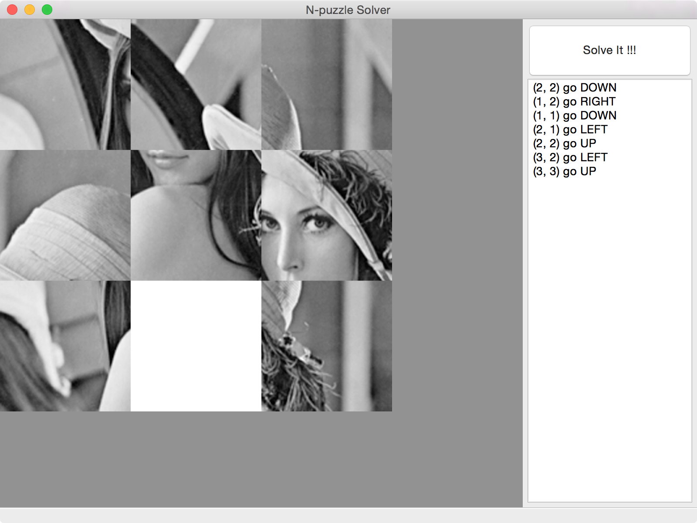
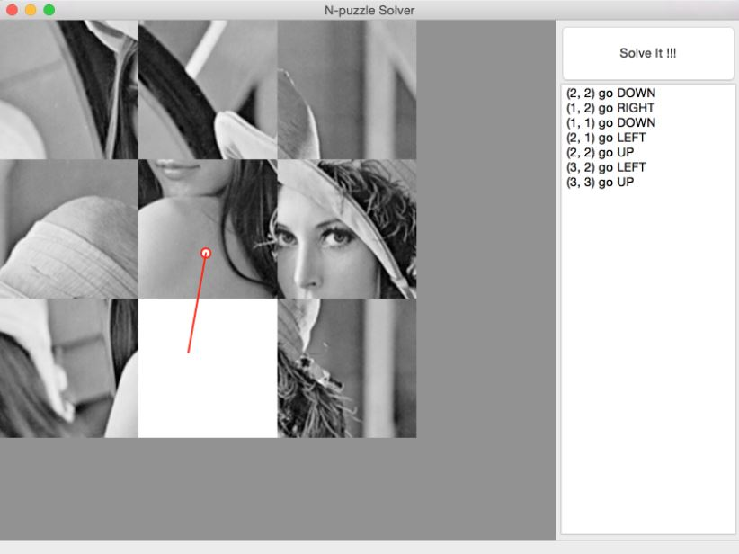
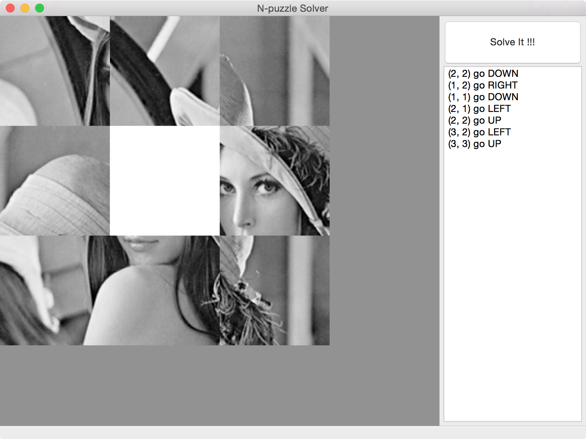

# n-puzzle-solver-with-CV

###Cmake

OpenCV dir point to : `opencv/build/`

###Workflow
 1. Load img that is mess-up
 2. Solve It !!!
 3. Follow the answer to move the tiles 

###ScreenShots

###Known Issue
 * 每個 `tile` 嚴格限制 `150*150 pixels`
 * 空格必須全白
 * `goal state`左上角不能是空格
 * `Segmenting()` 中判斷空格有誤差
 * 建關係時，有可能有 loop
 * ~~移動之後再按`Solve It!!!`會當掉~~
 * ~~`generateGoalState()` have bugz~~
 * ~~只接受 `2x2` 之puzzle~~
 * ~~只接受一個空格~~
